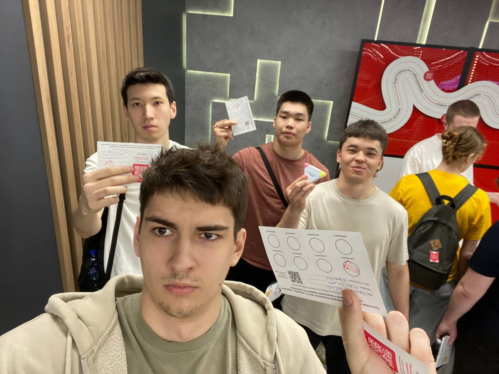

# BrassBook — Документация по проектной практике

## Описание проекта

Brassbook - это образовательная платформа для детей и подростков, занимающихся музыкой на медных, духовых и ударных инструментах детских музыкальных школ и школ искусств Российской Федерации. Они могут подключиться к своему преподавателю, записывать через плеер свою игру на инструменте и анализировать на ошибки. Могут получать оценки от преподавателя и слушать другие композиции, могут изучать музыку с помощью сборников нот с различными произведениями.

Это новый веб-сервис, аналогов которому ещё нет в РФ. Функции анализа на ошибки были реализованы с помощью интеграции с Искусственным интеллектом. Работа программистов на данный момент ещё ведётся.

Заказчиками данного проекта выступили преподаватели Санкт-Петербургской детской школы искусств имени С.С. Прокофьева — Азамат Анварович Латыпов и Татьяна Александровна Савинова.

## Структура статического сайта для практики

```
.
site/
├── css/
│   └── main.css
│   └── journal.css
│   └── about.css
│   └── members.css
│   └── resources.css
├── main.html
├── journal.html
├── about.html
├── members.html
├── resources.html
└──  img/
```

# Страницы сайта

## Главная страница

### Хедер
- **Меню навигации**:
  - Главная
  - О проекте
  - Участники
  - Журнал
  - Ресурсы

### Баннер(главная)
- **Логотип**: BRASSBOOK
- **Описание**: «Веб-платформа для юных музыкантов от преподавателей школы им. С.С.Прокофьева. Множество функций для обучения музыке и интеграция с искусственным интеллектом!»
  
### Раздел "итоги работы":
- **Разработали дизайн**
- **Написали код**
- **Предоставили проект заказчику и защитили**

## О проекте

**О ПРОЕКТЕ**: «Brassbook — это образовательная платформа, созданная для учеников классов медных духовыхи ударных инструментов детских музыкальных школ и школ искусств Российской Федерации...»
- **Процесс работы**: «Мы с ребятами получили бриф и указания для работы от заказчика проекта. Проанализировали их, просмотрели конкурентов и начала составлять прототип»

## Участники

### (участник):
- **мой вклад** описание моего вклада в проект.

## Журнал

Раздел «Журнал» - это медиа пространство.

### Здесь вы найдете:
- Мероприятия партнёров, которые посетили участники группы по практике.
- Отчёты.
- Результаты проекта в целом, события.

## Ресурсы

Страница **«Ресурсы»** содержит ссылки на связанные с проектом материалы.

## Участники

| Имя                        | Роль                                                                                        |
|----------------------------|---------------------------------------------------------------------------------------------|
| Мухамбетов Рустам Серкович | Разработка дизайна сайта. Разработка сайта, выполнение вариативной части, написание отчетов |

## Журнал прогресса

- 11.04.2025 — запуск проекта
- 13.04.2025 — разработка дизайна статического веб-сайта
- 20.04.2025 — разрабокта статического вейб-сайта
- 03.05.2025 — согласование вариативной части
- 15.05.2025 — разработка Telegram-бота на Python
- 16.05.2025 — написание отчёта, структурирование в GitHub, перероверка

## Взаимодействие с партнёром



### Мероприятие: Карьерный марафон
- Формат: Очная встреча
- Темы: обзор компаний
- Студенты, посетившие мероприятие: Мухамбетов Р.С.

Взаимодействовали с партерами вуза, такие как сбер, wb, яндекс, hh, рсхб, ингострах, 1с и тд. Подходили к партнерам (представителям компании), спрашивали про саму компанию, стажировки, работу, учавствовали в конкурсах, интерактивных мероприятиях.

## Используемые технологии

- Git + GitHub — контроль версий
- Markdown — документация
- HTML/CSS — стилизация
- VS Code — среда разработки

## Результат

- Сайт с 5 уникальными страницами
- Telegram-бот "BrassBook - какой ты инструмент?"
- Взаимодействие с партнёрами
- Подробная документация и отчёт по базовой части
- Подробная документация и отчёт по вариативной части
- Работа в команде и Git-практика