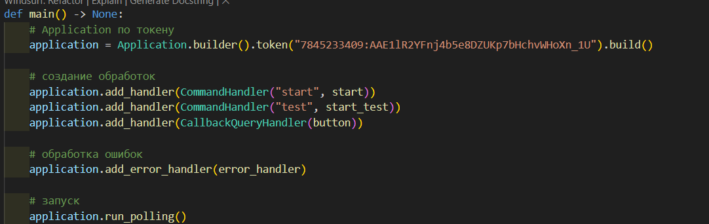

# Полное руководство по созданию Telegram-бота "Какой ты инструмент?" для BrassBook

## 1. Исследование предметной области

### 1.1 Анализ аналогичных ботов
Проведен анализ популярных тест-ботов в Telegram:
- Механика: последовательные вопросы с вариантами ответов
- Логика: подсчет результатов на основе выбранных ответов
- Визуал: интерактивные кнопки вместо текстового ввода
- Интеграция: ссылки на основной сервис

### 1.2 Выбор технологий
| Технология | Обоснование выбора |
|------------|--------------------|
| Python 3.10 | Стабильная версия с хорошей поддержкой библиотек |
| python-telegram-bot 20.x | Современная версия API Telegram |
| Logging | Встроенная система логирования |
| InlineKeyboard | Удобный интерфейс для тестов |

### 1.3 Прототипирование
Создано 3 прототипа:
1. Базовый бот с одним вопросом
2. Полная цепочка вопросов-ответов
3. Финальная версия с системой определения результата

## 2. Техническое руководство

### Структура проекта
```
.
src/
├── main.py
```
### 2.1 Основные компоненты

База вопросов


База инструментов


### 2.2 Ключевые функции

Запуск бота



Система вопросов


Определение результата


## 3. Определение результата


## 4. Модификации и улучшения

Реализованные улучшения:
    Обработка ошибок

## 5. Вклад участников

Мухамбетов Рустам Серкович - полный цикл разработки:

    1. Проектирование архитектуры бота

    2. Реализация основного функционала

    3. Настройка системы вопросов и ответов

    4. Интеграция с платформой BrassBook

    5. Тестирование и отладка

    6. Написание документации

